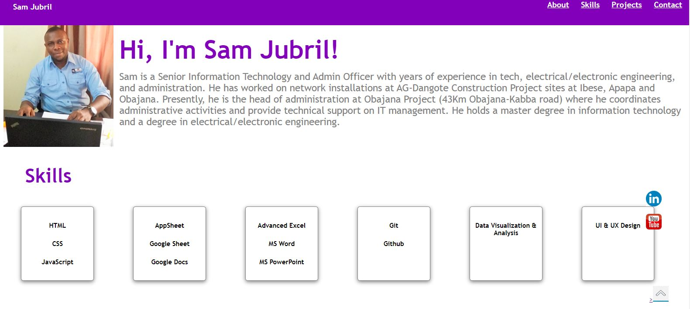

# SAM JUBRIL PORTFOLIO

A portfolio website for Sam Jubril

## Author

[@samjubril](https://www.linkedin.com/in/sam-jubril-90398460)

## Github repo

This is the [link](https://github.com/users/samjubril/projects/2) to the Github repo of the project

## Sample Website

A live demo is already available via this [link](https://samjubril.github.io/)

## Tools Used

Below are are list of tools used:

- HTML
- CSS
- JavaScript
- Atom IDE
- GitHub

## Folder Structure

The folder contains the following files:
- index.html
- style.css
- script.js
- readme
- linkedIn.png (Icon)
- youtube8.jpg Icon)
- samjubrilimage.jpg
- scroll-up2.jpg

If you have any job for me, kindly send me a DM on my [LinkedIn](https://www.linkedin.com/in/sam-jubril-90398460).
